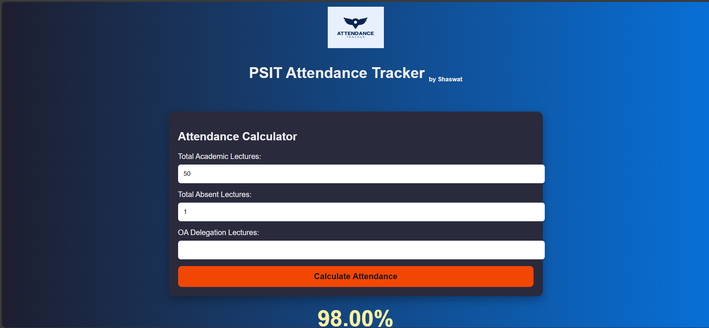
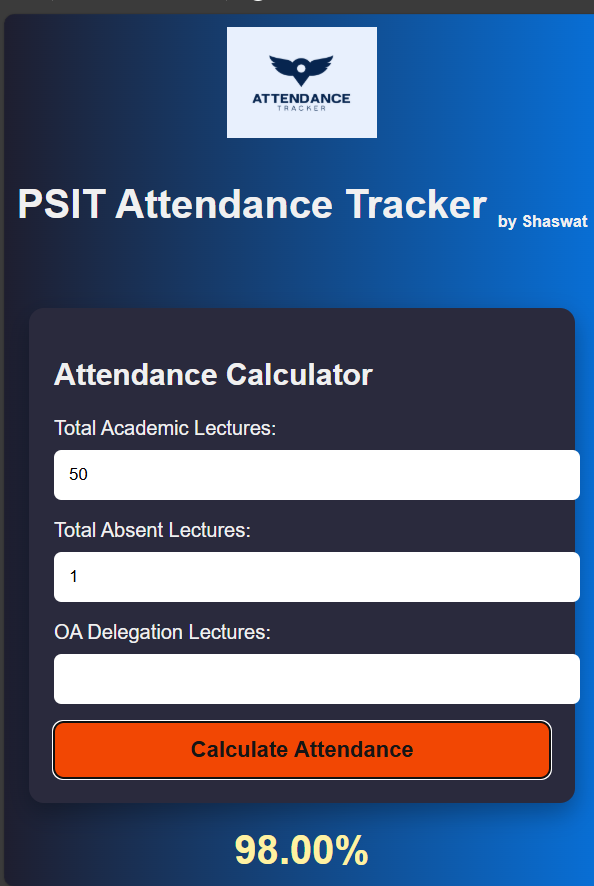

# 📊 PSIT Attendance Tracker

A simple and intuitive **attendance calculator** built for **PSIT students** to track current attendance and plan future attendance efficiently.

🚀 Live Demo: https://yourproject.netlify.app  
👨‍💻 Created by: **Shaswat**

---

## ✨ Features

- ✅ Calculate current attendance percentage
- 📉 See attendance status instantly
- 🔮 Future attendance prediction
- 🎓 Supports OA (Official Activity) delegations
- 📱 Fully responsive (Desktop & Mobile)
- 🎨 Clean UI with dark gradient theme

---

## 🖥️ Desktop View

---

## 📱 Mobile View

---

## 🛠️ Tech Stack

- **HTML5**
- **CSS3**
- **JavaScript (Vanilla)**
- **Font Awesome Icons**
- **Netlify** (Deployment)

---

## 📂 Project Structure

